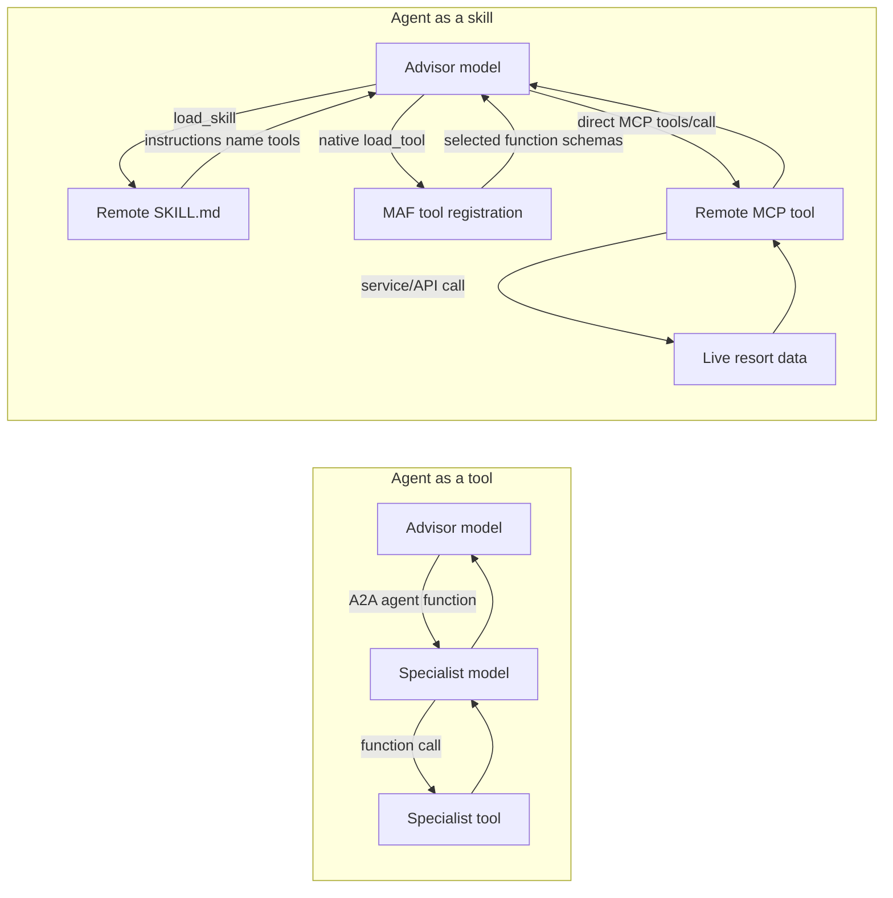
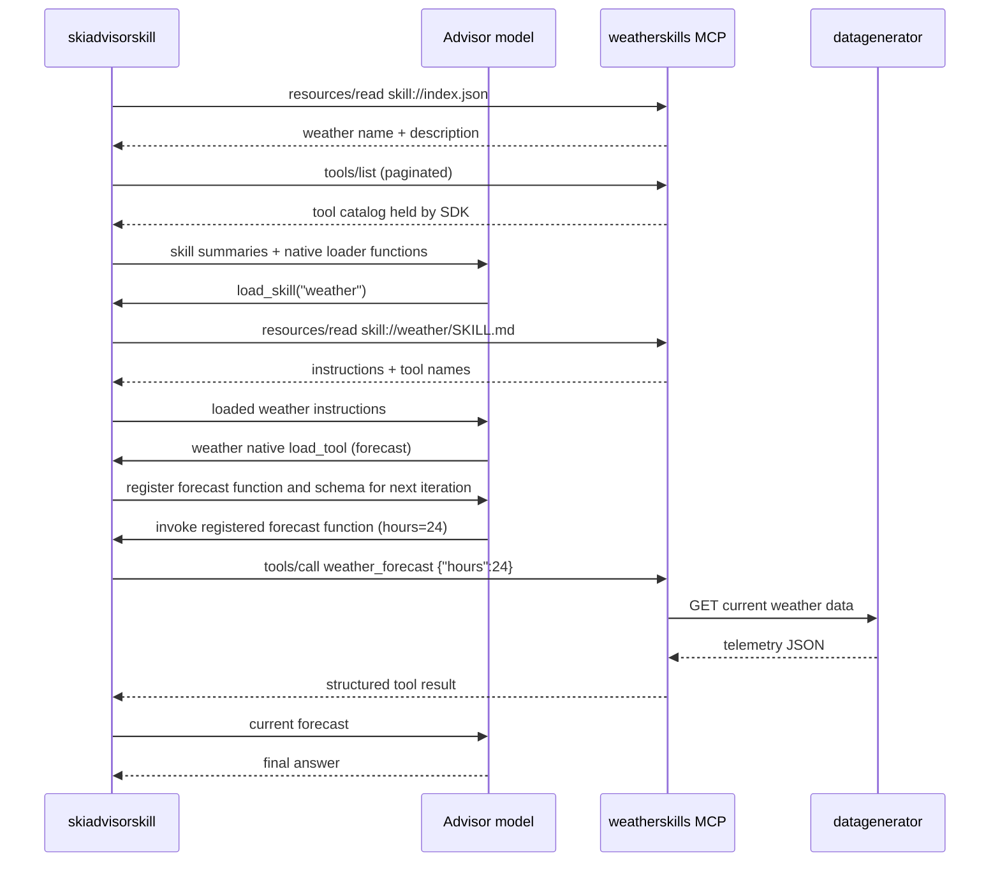

# 🏔️ AlpineAI – Multi-Agent Ski Resort System

## Overview

AlpineAI is a distributed, cloud-native, multi-agent system representing an intelligent ski resort platform.

The system is built using:

* **Microsoft Agent Framework (MAF)** as the agent orchestration layer
* **Agent-to-Agent (A2A)** for the existing agent-as-tool path
* **Agent Skills over MCP**, using a pinned historical SEP-2640 draft profile, for the parallel skills path
* **[Aspire](https://aspire.dev)** as the local development orchestrator
* Polyglot microservices (.NET + Python + Go)
* Real-time fake telemetry generator
* Event-driven communication
* A real-time frontend dashboard

The app deliberately exposes two alternative orchestration paths:

* `skiadvisora2a`: the existing .NET orchestrator consuming A2A agents as tools.
* `skiadvisorskill`: a Python orchestrator discovering .NET-hosted skills over MCP.

Weather, lift traffic, safety, and ski coach have paired compact Aspire
resources (`weatheragenta2a`/`weatherskills`, `safetyagenta2a`/`safetyskills`,
`skicoachagenta2a`/`skicoachskills`, and
`lifttrafficagenta2a`/`lifttrafficskills`). The existing Foundry ski researcher
remains a direct agent tool available to both orchestrators.

The skills advisor is Python and its MCP providers are .NET; the original
A2A advisor is .NET with Python/.NET specialists. These are implementation
choices, not required language changes. Both paths expose the same domains,
but model-selected work and answers need not be equivalent.

---

# 1. High-Level Architecture

## Core Components

| Component                | Language                       | Role                              |
| ------------------------ | ------------------------------ | --------------------------------- |
| Ski Advisor A2A           | .NET                           | A2A agent-as-tool orchestrator    |
| Ski Advisor Skill         | Python                         | MCP Agent Skills orchestrator     |
| Voice Advisor A2A         | .NET                           | Voice Live bridge to A2A specialists |
| Voice Advisor Skill       | .NET                           | Voice Live bridge to the skills orchestrator |
| Weather Agent            | Python                         | Weather intelligence              |
| Lift Traffic Agent       | .NET                           | Lift congestion analysis          |
| Safety Agent             | Python                         | Risk & slope safety validation    |
| Ski Coach Agent          | Python                         | Skill-based slope recommendation  |
| Real-Time Data Generator | Go                             | Fake telemetry + weather + events |
| Event Bus                | Cloud-native (Dapr or similar) | Pub/Sub event backbone            |
| Frontend Dashboard       | React / Next.js                | Visualization UI                  |
| API Gateway              | .NET                           | Unified access point              |

---

# 2. Agent Framework Layer

## Microsoft Agent Framework (MAF)

The A2A path exposes specialist Agent Cards and invokes them as remote tools.
The skills path exposes `skill://index.json` and `skill://<name>/SKILL.md`
instruction resources alongside twelve typed tools on independent .NET MCP
services. The Python orchestrator composes native `SkillsProvider` /
`MCPSkillsSource` with
`MCPStreamableHTTPTool(use_progressive_disclosure=True)`. The Foundry
researcher remains a separate agent tool. `CosmosHistoryProvider` uses a
dedicated `/session_id`-partitioned `skillhistory` container for the A2A host.

The index-based skill profile is a historical Draft revision, not the newest
SEP contract. As of September 10, 2026, the newer text is marked Accepted but
the PR remains unmerged; it specifies `skills/list` and `skills/get` instead.
Core MCP resources/tools and MAF's experimental progressive API are distinct.
See [compatibility details and pinned references](src/ski-advisor-skill/README.md#skill-transport-compatibility).

## Agent as a Tool vs Agent as a Skill

The term **agent as a skill** describes how this sample maps an existing
specialist-agent boundary onto Agent Skills. The skill is not itself an agent.
The Agent Card's name and description become discovery metadata, and its
system prompt becomes an enriched `SKILL.md`. Authentication and transport
remain infrastructure concerns. Tools stay tools, now served over MCP by the
remote domain services; the advisor selects them without a specialist model.



| Concern | Agent as a tool | Agent as a skill |
|---|---|---|
| Initial discovery | A2A Agent Card becomes an advisor function | `skill://index.json` advertises name and description |
| Domain instructions | Owned by the specialist model | Loaded into the advisor run from `SKILL.md` |
| Operation selection | Specialist model selects a function | Advisor model loads named MCP functions using the native SDK loader |
| Remote execution | Specialist tool executes behind the A2A agent | Registered function calls the skill provider's MCP tool |
| Model calls | Advisor + specialist | Advisor only |

## MCP Skill Contract

Each provider separates instructional resources from executable tools:

```text
skill://index.json                       # Discovery metadata
skill://weather/SKILL.md                 # Domain instructions and named-tool guidance
MCP tools/list                          # Typed operation definitions, host-side discovery
MCP tools/call weather_forecast          # Remote operation execution
```

Resources contain only discovery metadata and instructional content.
Operational tool handlers call the existing domain services and return
structured results. The provider has no specialist model:

```csharp
builder.Services.AddMcpServer()
    .WithHttpTransport()
    .WithResources<WeatherSkillResources>()
    .WithTools<WeatherTools>();

app.MapMcp("/skillsmcp");
```

The Python advisor uses native MAF skill loading and experimental progressive
MCP tool registration. A typical weather request proceeds as follows:



Skill-first selection is model guidance, not authorization or an atomic
load-and-register operation. A model can invoke native loaders directly.
Calling a provider's native `list_mcp_tools` reveals that provider's allowed
catalog; named-tool guidance normally avoids this. Configured endpoints,
provider prefixes, and native tool approval policy remain separate from
skill instructions. The SDK's mutable progressive-tool state has an isolated
lifetime rather than being shared between concurrent users. The 98-line `NativeMCPToolsMiddleware`
supplies per-invocation native runtime tool objects using public APIs. It does
not select operations or implement loading or dispatch. Shared MCP connections
remain open for app lifetime; tool objects remain alive through their response
streams. See the [skills advisor README](src/ski-advisor-skill/README.md#tool-lifetime-and-approval).

For genuinely small catalogs, eager loading with the standard SDK avoids this
progressive-state middleware entirely. The resort's twelve tools illustrate a
larger-catalog pattern, not a requirement to defer every small set of schemas.
See the [measured comparison](BLOG_DISTRIBUTED_AGENT_SKILLS.md#what-changed-in-latency-and-tokens)
for actual model-call counts, latency, whole-system tokens, and limitations.

---

# 3. Ski Resort Advisor Orchestrators

## Role

`skiadvisora2a` remains the default Responses-based chat orchestrator.
`skiadvisorskill` provides the alternative skills-based architecture and is
also exposed over A2A so the Voice Live bridge can call it as a remote tool.

Voice uses two Aspire resources backed by the same .NET project:
`voiceadvisora2a` registers the weather, lift traffic, safety, and ski coach
A2A agents plus the Foundry ski researcher, while `voiceadvisorskill`
registers only the `skiadvisorskilla2a` adapter. The frontend selects the
matching `/ws/voice/a2a` or `/ws/voice/skill` proxy route and preserves the
conversation ID in either architecture.

It:

* Receives user input
* Performs intent decomposition
* Invokes specialist agents via A2A
* Synthesizes final response
* Applies safety overrides

## Responsibilities

* Register other agents as tools
* Manage conversation memory
* Enforce priority rules (Safety > Weather > Coach)
* Aggregate distributed responses

## Tools It Consumes

| Tool                   | Provided By        |
| ---------------------- | ------------------ |
| get_current_conditions | Weather Agent      |
| get_forecast           | Weather Agent      |
| get_lift_status        | Lift Traffic Agent |
| get_wait_times         | Lift Traffic Agent |
| evaluate_risk          | Safety Agent       |
| recommend_slope        | Ski Coach Agent    |

## Technology

* .NET 8+
* Microsoft Agent Framework
* ASP.NET Core
* A2A client
* SignalR (for live frontend updates)

---

# 4. Weather Agent (Python)

## Role

Provides real-time weather and snow conditions.

## Data Source

Consumes data from:

* Real-Time Fake Data Generator

## Tools Exposed

* `get_current_conditions()`
* `get_forecast(hours: int)`
* `is_storm_incoming()`

## Responsibilities

* Aggregate telemetry
* Detect storm thresholds
* Provide structured condition summaries

## Technology

* Python 3.11+
* FastAPI
* Microsoft Agent Framework (Python SDK)
* A2A endpoint exposure

---

# 5. Lift Traffic Agent (.NET)

## Role

Manages lift telemetry and congestion intelligence.

## Data Source

Consumes:

* Lift queue events
* Lift operational status
* Telemetry stream

## Tools Exposed

* `get_lift_status(lift_id)`
* `get_wait_times()`
* `suggest_less_busy_area()`

## Responsibilities

* Compute congestion score
* Identify overload scenarios
* Emit congestion events

## Technology

* .NET 8
* Microsoft Agent Framework
* Background hosted service for event consumption

---

# 6. Safety Agent (Python)

## Role

Evaluates risk across slopes.

## Data Inputs

* Wind speed
* Snow intensity
* Avalanche risk index
* Lift failures
* Visibility metrics

## Tools Exposed

* `evaluate_risk(area)`
* `is_slope_safe(slope_id)`
* `get_closed_slopes()`

## Rules

* Wind > threshold → risk level increase
* Avalanche index high → slope closure
* Visibility low + steep slope → unsafe

## Technology

* Python
* FastAPI
* Microsoft Agent Framework
* Rule engine logic

---

# 7. Ski Coach Agent (Python)

## Role

Recommends slopes based on:

* Skill level
* Weather
* Congestion
* Safety

## Tools Exposed

* `recommend_slope(skill_level, preferences)`
* `build_day_plan(skill_level)`

## Data Source

* Static slope metadata
* Conditions from Weather Agent
* Congestion from Lift Traffic Agent

Note: It may call other agents via A2A if needed.

---

# 8. Real-Time Fake Data Generator (Go)

## Purpose

Continuously emits synthetic but realistic data so system behaves as live.

## Generates

### Weather Data

* Temperature
* Wind speed
* Snow intensity
* Visibility

### Lift Telemetry

* Queue length
* Lift status (open/closed)
* Throughput rate

### Safety Signals

* Avalanche index
* Incident reports

## Implementation

* Go HTTP service
* Updates telemetry every 5–10 seconds
* Publishes to Event Bus
* Also exposes REST endpoint for latest state

---

# 9. Event-Driven Backbone

Use:

* Dapr Pub/Sub OR
* Azure Service Bus OR
* Kafka (for demo simplicity optional)

Events:

* `WeatherUpdated`
* `LiftStatusChanged`
* `QueueUpdated`
* `SafetyAlertRaised`
* `SlopeClosed`

All agents subscribe to relevant topics.

---

# 10. Frontend Dashboard

## Technology

* React or Next.js
* SignalR client
* Real-time charts (Recharts or similar)

## Features

### Live Panels

* Weather dashboard
* Lift wait times
* Risk heatmap
* Open/Closed slopes
* Agent decision trace

### AI Chat Panel

* User interacts with Ski Resort Advisor
* Displays:

  * Tool calls
  * Agent responses
  * Final synthesized output

---

# 11. Observability

## Required

* Distributed tracing
* Correlation IDs
* Structured logging
* Metrics per agent

## Recommended Stack

* OpenTelemetry
* Azure Monitor OR Prometheus + Grafana

---

# 12. Deployment Target

* Azure Container Apps
* Container per agent
* Internal Dapr sidecar
* Horizontal scaling enabled
* Managed identity for secure agent communication

---

# 13. Local Development Orchestration (Aspire)

## Overview

[Aspire](https://aspire.dev) is used as the local development orchestrator for AlpineAI.

Aspire provides:

* Service discovery and orchestration across all agents and services
* Built-in dashboard for logs, traces, and metrics
* Simplified local environment setup (no need for manual Docker Compose wiring)
* Native OpenTelemetry integration

## Version

* Aspire **13.1.1** (latest)

## How It Works

The Aspire **AppHost** project defines the entire distributed application graph:

* Each agent (.NET and Python) is registered as a project or executable resource
* The Real-Time Data Generator runs as a background resource
* The Frontend Dashboard is registered as a Node.js app resource
* Service references and environment variables are wired automatically
* All dotnet projects must reference the [service-default project](./src/service-defaults/service-defaults.csproj) to implement common configuration calling `builder.AddServiceDefaults()` and `app.MapDfeltEndpoints()` in their startup

## Benefits for This System

* Single `F5` experience to launch all agents, the data generator, and the frontend
* Centralized dashboard showing health, logs, and distributed traces across all agents
* Automatic port management and service endpoint injection
* No Docker Compose required for local development

## Documentation

* Official site: [https://aspire.dev](https://aspire.dev)

---

# 14. System Interaction Flow

## Example Request

User:
"I am intermediate, I dislike crowds, and wind is strong. Where should I ski?"

### Flow

1. Ski Resort Advisor receives request
2. Calls Weather Agent
3. Calls Lift Traffic Agent
4. Calls Safety Agent
5. Calls Ski Coach Agent
6. Applies safety override if needed
7. Synthesizes response
8. Emits decision trace to frontend

---

# 15. Non-Functional Requirements

* All agents stateless
* Horizontal scalability
* Resilient to agent downtime
* Safety agent always has highest priority
* Real-time update latency < 2 seconds
* System must run locally with Aspire (see section 13)

---

# 16. Folder Structure (Suggested)

```
/alpine-ai
  /ski-advisor-a2a
  /ski-advisor-skill
  /voice-advisor-agent
  /lift-traffic-agent-a2a
  /weather-agent-a2a
  /safety-agent-a2a
  /ski-coach-agent-a2a
  /weather-skills
  /safety-skills
  /ski-coach-skills
  /lift-traffic-skills
  /data-generator
  /frontend
  /infrastructure
```

---

# 17. Key Architectural Principles

* Agent-as-a-Tool
* Single responsibility per agent
* Event-driven reactivity
* Orchestrated intelligence
* Safety-first overrides
* Real-time observability

---
