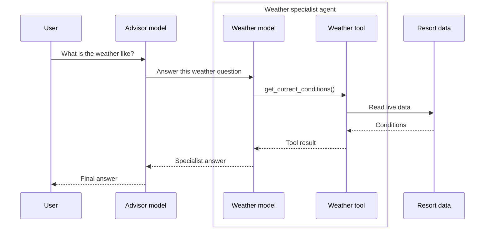
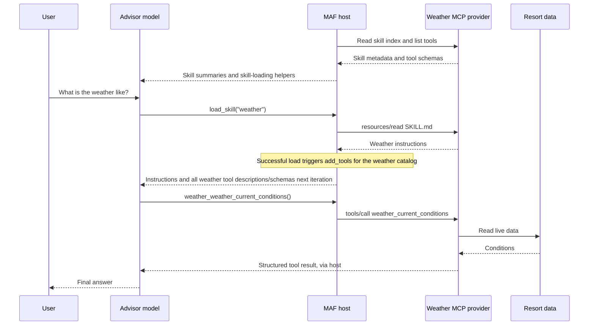

# From agents as tools to distributed skills over MCP

*Keep your domain services distributed. Move the specialist's instructions, not another model, into the orchestrator.*

A multi-agent system often starts with a straightforward design: one agent understands the user's request, delegates to specialist agents, and combines their answers.

That was the starting point for my ski resort demo. A resort advisor calls specialists for weather, safety, ski coaching, and lift traffic. Each specialist owns its instructions and tools, and the advisor invokes it through Agent-to-Agent (A2A).

It works. But it also raises a useful question:

**Does every specialist need its own model execution, or does the parent mostly need the specialist's instructions and access to its operations?**

To explore that distinction, I added a second architecture to the same application: **distributed Agent Skills and tools served over Model Context Protocol (MCP)**.

The services still run separately. The domain boundaries still exist. What changes is where the reasoning happens.

This post compares those two paths, walks through the migration from specialist agents to distributed skills and MCP tools, and uses the demo's execution traces to examine what changed in model calls, latency, and token consumption.

## Two patterns, two kinds of delegation

### Agent as a tool: delegate the task

In the original architecture, the advisor sees each remote agent as a function it can call.

For a weather question, the flow looks like this:



The weather agent is an independent reasoning component. It interprets the delegated question, selects its tools, and writes a response. The advisor then interprets that response and produces the final answer.

This is a good fit when the specialist needs autonomy: its own model, private context, a substantial workflow, or an independent lifecycle.

### Distributed skill: delegate the operation, share the instructions

In the skills architecture, the weather service no longer needs a model to interpret that question.

Instead, it publishes a description, a `SKILL.md` document, and typed MCP tools. The advisor loads the instructions when needed, receives the associated tool definitions, and uses them to select the next operation. The advisor host uses Microsoft Agent Framework (MAF) to manage this flow:



There is no weather-agent model in this second path. There is still a weather service executing application code.

A distributed skill is not an agent wrapped in Markdown. It gives the advisor a procedure to follow; the provider's tools execute the operations that procedure calls for.

| Concern | Agent as a tool | Distributed skill |
|---|---|---|
| What the parent discovers | A specialist agent exposed as a tool | A competence it can load |
| Where specialist instructions run | In the specialist's model context | In the parent's model context |
| Who selects domain operations | The specialist model | The parent model |
| What executes remotely | A specialist agent loop and its tools | MCP tools and their backing services |
| What remains distributed | Agents, services, data | Skill providers, services, data |

This is not "MCP replaces A2A everywhere." A2A and MCP address different boundaries: an autonomous agent can remain an agent, while a bounded competence can become a skill.

It is also not "one agent means one model call." Loading instructions, calling operations, and producing an answer can still require several model requests. The difference is that the migrated domain no longer adds its own nested reasoning loop.

## What actually migrates?

| Existing component | Skills-based equivalent |
|---|---|
| Specialist A2A hosting | MCP hosting for that domain's skills and tools |
| Agent Card name and description | Skill discovery name and description |
| Specialist system prompt | Domain procedure in an enriched `SKILL.md` |
| Specialist tools and parameter contracts | Typed MCP tools with input and output schemas |
| Business services and connectors | Remote services behind those tool handlers |
| Advisor's remote-agent function registrations | Native skill sources and MCP tool integration |
| Specialist's model loop | No equivalent inside the migrated provider |

Not everything in an Agent Card belongs in a skill description. Endpoint configuration, authentication, and transport capabilities remain infrastructure concerns. Similarly, instructions about permissions do not replace authorization checks in code.

The ski resort example keeps both architectures side by side. Four specialists have corresponding MCP providers: weather, safety, ski coaching, and lift traffic. A web-research agent remains an ordinary agent tool in both advisors.

That hybrid choice is deliberate. Migration does not require turning every capability into the same shape.

**Language note:** the skills advisor is Python and its four MCP providers are .NET. The A2A advisor is .NET, with Python and .NET specialists. These are independent implementation choices, not a requirement to rewrite services in another language. They explain why the examples below use both languages.

## Step 1: separate the competence from the agent runtime

Start inside the specialist, not at its endpoint.

A typical specialist combines three things: instructions, an agent/model runtime, and functions that reach the business system. Separate those responsibilities before changing the protocol.

For weather, retrieving conditions and calculating the demonstration forecast already belong to a domain service. That service is the reusable part: it does not need another model to read an observation or calculate a forecast.

Keep the service's business rules, data access, and validation. Move the specialist's instructions into a skill, expose its operations through MCP tools, and remove its model loop only if the advisor can take over operation selection and result interpretation.

"No model in the provider" does not mean constant output. The demo's telemetry changes over time, and its forecast uses randomized variation. The distinction is application logic versus another agent loop.

## Step 2: turn the Agent Card description into skill discovery

An orchestrator does not need every specialist's full instructions on every request. It needs enough information to decide which competence is relevant.

Each provider exposes its own MCP endpoint at `/skillsmcp`. Its resource surface contains only:

```text
skill://index.json
skill://<skill-name>/SKILL.md
```

For weather, the index is:

```json
{
  "$schema": "https://schemas.agentskills.io/discovery/0.2.0/schema.json",
  "skills": [
    {
      "name": "weather",
      "type": "skill-md",
      "description": "Weather intelligence agent providing real-time conditions, forecasts, and storm alerts for the ski resort",
      "url": "skill://weather/SKILL.md"
    }
  ]
}
```

The description carries the former Agent Card's routing information: when this competence is useful. It does not transfer the card's network or security configuration.

The `skill://` URI identifies content on an already configured MCP connection. It is not a hostname to resolve or a way for skill text to choose a new network endpoint. Additional supporting files, when needed, remain instructional resources.

## Step 3: move the specialist's procedure into `SKILL.md`

The description answers **when to use the competence**. `SKILL.md` answers **how to apply it**.

The former specialist's system prompt supplies the starting material: domain rules, interpretation, safety priorities, and response guidance. Review those instructions, remove assumptions about an independent conversation, and add the procedure for choosing the available tools.

Here is a **portable illustrative procedure**, not a verbatim copy of the demo's generated document:

```markdown
---
name: weather
description: Assess current resort weather, forecasts, and storm threats.
---

# Weather procedure

1. Use weather_current_conditions for current temperature, wind,
   snow intensity, visibility, and observation time.
2. Use weather_forecast when the request concerns later conditions.
   Supply an integer hours value from 1 through 24.
   Explain that this demo forecast is a simulation, not a weather service.
3. Use weather_storm_status when a storm assessment is relevant.
4. Report specific values with their units and source limitations.
   Prioritize safety and do not invent missing observations.
```

The procedure refers to MCP operations by name, such as `weather_forecast`, and explains when to use them. MCP supplies the tool descriptions and parameter schemas the advisor needs to make the calls.

The demo supplements this procedure with a short section describing how tools become available in this advisor: loading the skill exposes its provider's tools on the next model iteration. It also lists the callable names with the host's provider prefix—for example, `weather_forecast` becomes `weather_weather_forecast`. This keeps the domain procedure separate from the details of how the host exposes its tools.

## Step 4: expose the specialist's operations as MCP tools

The operations remain tools; what changes is how the advisor reaches them. Instead of asking a specialist agent to choose an operation, it invokes a typed MCP tool directly.

The following is an excerpt from `WeatherTools.cs`; the result records and JSON-to-record helper are defined in the same file:

```csharp
[McpServerTool(
    Name = "weather_forecast",
    ReadOnly = true,
    Destructive = false,
    UseStructuredContent = true)]
[Description("Generate a demo hourly forecast from current conditions. Forecast variation is randomized.")]
public async Task<WeatherForecast> Forecast(
    [Description("Forecast horizon in hours, from 1 through 24."),
     Range(1, 24)] int hours,
    CancellationToken cancellationToken)
{
    if (hours is < 1 or > 24)
        throw new ArgumentOutOfRangeException(
            nameof(hours), "Hours must be between 1 and 24.");

    return Read<WeatherForecast>(
        await service.GetForecastAsync(hours, cancellationToken));
}
```

The .NET MCP SDK publishes the tool definition and binds calls to the method. The handler validates the range, passes cancellation through, and delegates to the existing service. The skill's prose guides operation selection; it does not replace the parameter schema or server-side validation.

The provider hosts these tools alongside the instructional resources over Streamable HTTP:

```csharp
builder.Services.AddMcpServer(options =>
    {
        options.ServerInfo = new()
        {
            Name = "weatherskills",
            Version = "1.0.0"
        };
    })
    .WithHttpTransport()
    .WithResources<WeatherSkillResources>()
    .WithTools<WeatherTools>();

var app = builder.Build();
app.MapMcp("/skillsmcp");
app.Run();
```

This shortened snippet omits ordinary domain-service and HTTP-client registration. `resources/read` retrieves instructions. `tools/list` supplies authoritative operation definitions. **`tools/call` executes the business operations.**

## Step 5: replace remote-agent registrations with skills and tools

Previously, the advisor resolved an A2A Agent Card and registered the remote agent as an AI function. In shortened form:

```csharp
var resolver = new A2ACardResolver(
    endpoint,
    httpClient,
    agentCardPath: "/.well-known/agent-card.json");

var card = await resolver.GetAgentCardAsync();
var remoteAgent = card.AsAIAgent(httpClient);
var specialistTool = remoteAgent.AsAIFunction();
```

The new advisor connects to MCP providers instead. Native MAF `SkillsProvider` and `MCPSkillsSource` handle skill discovery and instruction loading.

The demo also defers tool exposure until the model selects a skill. **For a small catalog, this is optional:** register the MCP tools upfront and load only the instructions on demand. The resort's four skills and twelve tools illustrate a pattern intended for larger catalogs.

In this sample, loading a skill gives the advisor both the instructions and the tools to follow them. `SkillToolsMiddleware` connects those two steps: once `load_skill` succeeds, it uses MAF's `add_tools` API to make the associated MCP provider's tools available on the next model iteration. This small piece of advisor-side code ([`native_mcp.py`](https://github.com/tommasodotNET/ski-resort-demo/blob/56f453a2c52de91ac71ef19da83caec4976f5a17/src/ski-advisor-skill/skills_orchestrator_python/native_mcp.py)) defines which tools accompany each skill; MAF handles their registration and invocation.

The code in [`agent_builder.py`](https://github.com/tommasodotNET/ski-resort-demo/blob/56f453a2c52de91ac71ef19da83caec4976f5a17/src/ski-advisor-skill/skills_orchestrator_python/agent_builder.py) wires the skill provider and middleware into the advisor:

```python
skill_tools = SkillToolsMiddleware(connections)
skills = SkillsProvider(
    skill_tools.source,
    disable_load_skill_approval=True,
    disable_read_skill_resource_approval=True,
)

agent = client.as_agent(
    name="skiadvisorskill",
    instructions=INSTRUCTIONS,
    context_providers=[skills],
    tools=[researcher_tool],
    middleware=[skill_tools],
)
await skill_tools.initialize(agent, exit_stack)
```

`context_providers=[skills]` makes the skills discoverable and their instructions loadable. `middleware=[skill_tools]` connects a successful skill load to the corresponding tool catalog.

The wiring separates what the host knows from what the model sees. At startup, the host discovers the skills and retrieves each provider's tool catalog through MCP `tools/list`. The model initially receives only the skill summaries and loading helpers, alongside the existing researcher tool—not every provider's operation schemas.

For example, when the advisor calls `load_skill("weather")`, MAF retrieves the weather instructions. After confirming that the load succeeded, the middleware makes all three weather tools available for the current run. On the next model iteration, the advisor sees their descriptions and parameter schemas and chooses which operation to call. Tools from other providers remain out of context until their skills are loaded; making a tool available does not execute it.

**The middleware binds a successfully loaded skill to a provider catalog. MAF handles function registration, deduplication, schemas, dispatch, and execution.**

## Following a real execution

For the comparison, I sent this exact prompt through both chat paths of the same running Aspire application, using skill-scoped implementation `56f453a`:

> considering weather and waiting time, where should i start?

Both requests entered through the frontend's Responses API proxy. One advisor used A2A specialists internally; the other used native MCP skills and tools. This compares two complete advisor paths, not a raw A2A request against a single MCP call.

In pairs 1 and 2, the A2A advisor selected weather and lift traffic. Each specialist used two model calls, and the advisor used two: six in total. In pair 3, it also selected the coach, whose single call requested missing skier information:

```text
A2A pair 3: observed call structure
  chat gpt41                         advisor selects specialists
  overlapping specialist calls:
    weatheragenta2a
      chat gpt41
      get_current_conditions
      chat gpt41
    lifttrafficagenta2a
      chat gpt41
      GetWaitTimes
      SuggestLessBusyArea
      chat gpt41
    skicoachagenta2a
      chat gpt41                     asks for skill level/preferences
  chat gpt41                         recommends Eagle Chair and asks about ability
```

That is seven model calls, not seven sequential calls. The remote specialists overlap, so adding their durations would not give client elapsed time.

All three skill-scoped runs selected weather and lift traffic and used this three-call model sequence:

```text
chat gpt41 #1
  load_skill({"skill_name":"weather"})
  load_skill({"skill_name":"lift-traffic"})

chat gpt41 #2
  weather_weather_current_conditions({})
  lifttraffic_lift_traffic_least_busy_area({})

chat gpt41 #3
  final answer
```

The host registered all three weather tools and all four lift-traffic tools after the skill reads. The model then selected one operation from each group, with their descriptions and schemas available. There was no separate tool-loader call. Skill reads and the two operation calls were each batched within their respective model iteration. All three model calls belonged to the advisor; `invoke_agent` aggregates are not additional model calls.

All six responses recommended Eagle Chair. They did not perform identical work: A2A called both `GetWaitTimes` and `SuggestLessBusyArea`, whereas the skills advisor called only `lift_traffic_least_busy_area`. Pair 3's A2A response also asked about skier ability after consulting the coach. Weather values and queue times changed between requests.

## What changed in latency and tokens?

These measurements were captured using the `gpt41` deployment.

Each request used the exact prompt quoted above and a fresh conversation, with no previous response ID or history. All six reused already-running services and connections. The order was A2A/native in pair 1, native/A2A in pair 2, and A2A/native in pair 3, with at least 65 seconds between responses and subsequent requests.

Elapsed time is client wall-clock time from sending the frontend POST until its SSE response body finishes. It includes proxy, model, and tool work, but excludes cooldowns. It is not time to first token.

Token totals sum each unique leaf **`chat gpt41`** span once, including every remote A2A specialist. They do not add the `invoke_agent` aggregates or top-level API usage again.

| Pair | Architecture | Elapsed | Input tokens | Output tokens | Total tokens | Model calls | Cached input |
|---|---|---:|---:|---:|---:|---:|---:|
| 1 | A2A specialists | 16.416 s | 2,971 | 578 | 3,549 | 6 | Partial<sup>*</sup> |
| 1 | Native MCP skills | 8.661 s | 4,341 | 178 | 4,519 | 3 | 1,536 |
| 2 | Native MCP skills | 5.866 s | 4,337 | 165 | 4,502 | 3 | 1,536 |
| 2 | A2A specialists | 12.835 s | 2,974 | 580 | 3,554 | 6 | Partial<sup>*</sup> |
| 3 | A2A specialists | 17.188 s | 3,394 | 637 | 4,031 | 7 | Partial<sup>*</sup> |
| 3 | Native MCP skills | 4.517 s | 4,341 | 171 | 4,512 | 3 | 3,072 |

<sup>*</sup> *A2A advisor spans reported zero cached input; specialist spans omitted cache counters. Whole-system cached input is therefore unknown, not zero. Native cached tokens are already included in input totals.*

**The skills path was faster in these reused-process, cache-affected runs:** mean elapsed time was 6.348 seconds versus 15.480 seconds for A2A. This does not isolate an architectural speedup from cache effects, first-use credential initialization, language/runtime differences, or the amount of work performed.

**It did not use fewer total tokens.** Across three runs, native skills consumed 13,533 observed tokens versus 11,134 for A2A, about 22% more. Fewer model calls did not mean less cumulative context. In the first skills run, input counts were 866, 1,593, and 1,882, totaling 4,341 as instructions, provider-group schemas, and results accumulated.

That is **not a billable-cost ratio**. Native runs reported 6,144 cached input tokens overall, and A2A specialist cache reporting was incomplete. Input, cached input, and output have different pricing implications. These measurements report tokens, not a dollar comparison.

There is an accounting trap in the other direction too. Pair 1's A2A Responses usage reported 1,751 tokens for the advisor. Weather added 633 and lift traffic 1,165, bringing the observed whole-system total to 3,549. Comparing only top-level API usage would omit more than half that request's tokens.

This is a three-pair illustration, not a controlled performance or quality study. Processes were reused, prompt-cache hits varied, and live telemetry changed during cooldowns. A2A performed more lift queries and added a coach exchange in pair 3. All skills responses, and A2A's first response, used safety language without consulting the safety provider; those statements are not verified safety findings. Faster responses do not establish equally correct or complete advice.

The structural observation is narrower: **six, six, and seven model calls across A2A components versus three calls in each skills-advisor run**, with skill loading followed immediately by direct MCP operations. Whether that tradeoff helps another workload requires its own acceptance criteria and measurements.

## What I would carry into a production migration

Start with one bounded, read-oriented domain and keep the old path available. Compare routing, data correctness, and structured results before switching traffic.

Keep important behavior in code. A skill can describe how to paginate, but it does not persist a cursor. It can explain an approval step, but it does not enforce authorization. It can mention an attachment, but it does not manage the file's lifecycle.

Choose eager versus skill-scoped exposure according to the real catalog and workload. With a small catalog, attach the native MCP tools directly to the agent and omit the registration middleware. You can still load instructions on demand.

A skill should group related operations. This demo has one skill per provider; several unrelated skills on one server would need a more specific tool association. Loading a whole provider avoids a separate per-tool loading step but supplies schemas that may not all be used; a smaller initial context is not automatically a faster or cheaper conversation.

Finally, decide where autonomy is actually valuable. A research agent, a long-running workflow, or a component with a specialized model may deserve to remain an agent. Putting that component behind MCP without changing its internals would still leave a remote agent loop; it would be a transport change, not the architectural transformation described here.

## The takeaway

The useful distinction is not "many services versus one service" or even "A2A versus MCP."

It is **delegating a task to another reasoner versus giving the current reasoner a competence and access to its operations**.

Distributed skills let us keep domain ownership, service boundaries, and independent deployment while avoiding a separate agent loop for capabilities that do not need one.

In this demo, the weather specialist became a description, a procedure, and tools. The weather service stayed remote. The reasoning moved into the advisor.

That is the pattern worth testing in your own system.

## Compatibility and limitations

The architecture separates three contracts: the [Agent Skills document format](https://agentskills.io/specification), the MCP transport used to discover and retrieve those documents, and the host SDK's tool-registration API. Core MCP resources and tools do not, by themselves, define the skill-to-provider association used in this sample.

**Skill transport, checked September 10, 2026:** the demo's `skill://index.json` discovery follows a pinned, historical [Draft revision of SEP-2640](https://github.com/modelcontextprotocol/modelcontextprotocol/blob/b3f015a7929041dada4b0eaf5a657b30d4f5d6d1/seps/2640-skills-extension.md) and the installed `MCPSkillsSource`. The [September 3 revision](https://github.com/modelcontextprotocol/modelcontextprotocol/blob/d6b31a03504c15677d49b922b6b6ace0ef65728d/seps/2640-skills-extension.md) says Accepted and specifies `skills/list` and `skills/get`, but its [PR was still open and unmerged](https://github.com/modelcontextprotocol/modelcontextprotocol/pull/2640) at that check. The demo does not implement those newer methods; its index is not a universal core MCP requirement.

**Host integration:** this sample uses `agent-framework-core==1.17.0`, whose public `FunctionInvocationContext.add_tools` API is experimental. Its native `load_skill` returns text rather than a typed success envelope, which explains the middleware's content comparison. Pin and review the SDK and skill-transport versions when adapting the example; the small custom skill-to-provider binding is separate from both contracts.

---

### Code and references

Repository: **[Ski resort multi-agent and distributed skills demo](https://github.com/tommasodotNET/ski-resort-demo)**.

The implementation is pinned to [commit `56f453a`](https://github.com/tommasodotNET/ski-resort-demo/commit/56f453a2c52de91ac71ef19da83caec4976f5a17). These permalinks identify the skill-scoped code used for this article:

| Area | Code path |
|---|---|
| Original A2A advisor | [`src/ski-advisor-a2a/Program.cs`](https://github.com/tommasodotNET/ski-resort-demo/blob/56f453a2c52de91ac71ef19da83caec4976f5a17/src/ski-advisor-a2a/Program.cs) |
| Shared skills advisor construction | [`agent_builder.py`](https://github.com/tommasodotNET/ski-resort-demo/blob/56f453a2c52de91ac71ef19da83caec4976f5a17/src/ski-advisor-skill/skills_orchestrator_python/agent_builder.py) |
| Skill-to-provider registration hook | [`native_mcp.py`](https://github.com/tommasodotNET/ski-resort-demo/blob/56f453a2c52de91ac71ef19da83caec4976f5a17/src/ski-advisor-skill/skills_orchestrator_python/native_mcp.py) |
| Provider endpoints and prefixes | [`config.py`](https://github.com/tommasodotNET/ski-resort-demo/blob/56f453a2c52de91ac71ef19da83caec4976f5a17/src/ski-advisor-skill/skills_orchestrator_python/config.py) |
| Generated weather skill | [`WeatherSkillCatalog.cs`](https://github.com/tommasodotNET/ski-resort-demo/blob/56f453a2c52de91ac71ef19da83caec4976f5a17/src/weather-skills/Skills/WeatherSkillCatalog.cs) |
| Weather tool adapters and typed results | [`WeatherTools.cs`](https://github.com/tommasodotNET/ski-resort-demo/blob/56f453a2c52de91ac71ef19da83caec4976f5a17/src/weather-skills/Tools/WeatherTools.cs) |
| Weather instructional resources and host | [`WeatherSkillResources.cs`](https://github.com/tommasodotNET/ski-resort-demo/blob/56f453a2c52de91ac71ef19da83caec4976f5a17/src/weather-skills/Skills/WeatherSkillResources.cs), [`Program.cs`](https://github.com/tommasodotNET/ski-resort-demo/blob/56f453a2c52de91ac71ef19da83caec4976f5a17/src/weather-skills/Program.cs) |
| Native-loop and local MCP coverage | [`tests/`](https://github.com/tommasodotNET/ski-resort-demo/tree/56f453a2c52de91ac71ef19da83caec4976f5a17/src/ski-advisor-skill/tests) |
| Aspire topology | [`src/apphost.cs`](https://github.com/tommasodotNET/ski-resort-demo/blob/56f453a2c52de91ac71ef19da83caec4976f5a17/src/apphost.cs) |

Additional protocol and SDK references:

- [MCP resources](https://modelcontextprotocol.io/specification/2025-11-25/server/resources) and [MCP tools](https://modelcontextprotocol.io/specification/2025-11-25/server/tools): the protocol primitives used here.
- [MAF function-invocation registration API](https://github.com/microsoft/agent-framework/blob/4507512f95effaae4518d658e86e9afc0ccb4514/python/packages/core/agent_framework/_middleware.py) and [native MCP implementation](https://github.com/microsoft/agent-framework/blob/4507512f95effaae4518d658e86e9afc0ccb4514/python/packages/core/agent_framework/_mcp.py): the SDK APIs used by the host integration.
