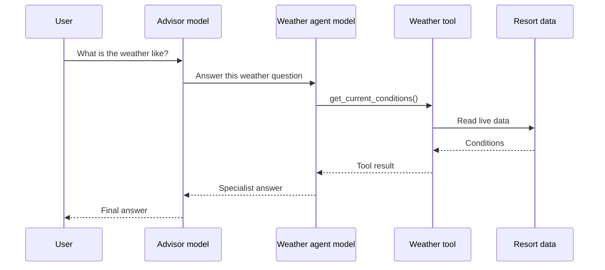
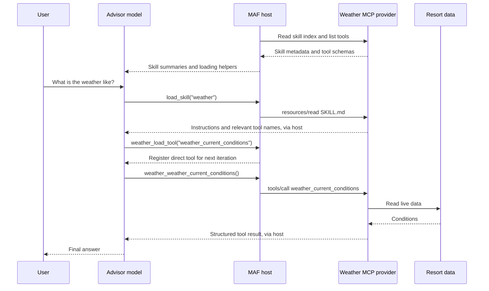

# From agents as tools to distributed skills over MCP

*Keep domain services distributed. Move the specialist's instructions into the advisor, and keep its operations as tools.*

A multi-agent system often starts with a straightforward design: one agent understands the user's request, delegates to specialists, and combines their answers.

That was the starting point for my ski resort demo. An advisor calls weather, safety, ski-coach, and lift-traffic agents over Agent-to-Agent (A2A). Each specialist has its own instructions, tools, and model loop.

It works. But does every specialist need to reason independently, or does the advisor mainly need its instructions and access to its operations?

To explore that distinction, the demo now has a second path: **distributed Agent Skills and tools over Model Context Protocol (MCP), composed with native Microsoft Agent Framework (MAF) capabilities**. Domain services still run remotely. Their instructions enter the advisor's context when needed, and their operations execute as ordinary MCP tools without another specialist model.

**Language note:** the skills advisor is Python and its four MCP providers are .NET. The A2A advisor is .NET, with Python and .NET specialists. These are independent implementation choices, not a requirement to rewrite services in another language. They explain why the examples below use both languages.

**Compatibility note, checked September 10, 2026:** the demo uses a pinned, historical [Draft profile of SEP-2640](https://github.com/modelcontextprotocol/modelcontextprotocol/blob/b3f015a7929041dada4b0eaf5a657b30d4f5d6d1/seps/2640-skills-extension.md). The proposal's latest text says Accepted, but its [PR remains unmerged](https://github.com/modelcontextprotocol/modelcontextprotocol/pull/2640) and newer discovery differs. Do not confuse this version-specific skill-transport profile with established core MCP resources and tools, or with MAF's separately experimental progressive-loading API.

## A small demo of a larger-catalog problem

The resort has only four skills and twelve tools. It is a simple setting for illustrating a problem that becomes more interesting with a large catalog: how to give the model the right procedures and tool schemas without placing everything in its initial context.

**For a genuinely small catalog, start simpler:** register the configured providers' MCP tools upfront using the standard SDK. You can still load skill instructions on demand. Progressive tool loading is optional, and the request-lifetime middleware discussed below is unnecessary in that eager-loading setup.

The goal here is to explore the larger-catalog pattern, not to claim that twelve tools require it.

## Two kinds of delegation

### Agent as a tool: delegate a task

The A2A advisor sees each remote agent as a callable function:



The specialist interprets a delegated question, chooses operations, and writes an answer. The advisor then interprets that answer. This is useful when the specialist needs autonomy, private context, a specialized model, or a substantial independent workflow.

### Agent as a skill: share a procedure, invoke an operation

The MCP provider instead publishes skill metadata, instructional documents, and typed tools:



There is no weather-agent model in the second path. There is still a weather service executing application code.

This is not "MCP replaces A2A everywhere." It changes the reasoning boundary for bounded capabilities. Nor does "one agent" mean "one model call": instruction loading, tool loading, operation selection, and answer generation can require several iterations.

## What actually migrates?

| Existing component | Skills-based equivalent |
|---|---|
| Specialist A2A hosting | MCP hosting for that domain's skills and tools |
| Agent Card name and description | Skill discovery name and description |
| Specialist system prompt | Domain procedure in an enriched `SKILL.md` |
| Specialist tools and parameter contracts | Typed MCP tools with input and output schemas |
| Business services and connectors | Remote services behind those tool handlers |
| Advisor's remote-agent function registrations | Native skill sources and MCP tool integration |
| Specialist's model loop | No equivalent inside the migrated provider |

Only the Agent Card's descriptive identity maps into skill metadata. Authentication, endpoints, and transport capabilities remain infrastructure concerns, not prose.

Most importantly, **tools stay tools**. The migration moves instructions and operation selection into the advisor. It does not move business logic into Markdown or require domain services to run inside the advisor process.

Both architectures remain available in this demo. The web-backed research agent also remains a direct agent tool in both advisors. Its independent reasoning is a separate choice from how weather or lift data is retrieved.

## 1. Separate domain logic from the specialist runtime

Start inside the specialist, not at its endpoint. Identify its instructions, model loop, and functions that reach the business system.

For weather, retrieving conditions and calculating the demonstration forecast already belong to a domain service. Expose that capability through a typed MCP adapter. The following is an excerpt from `WeatherTools.cs`; the result records and JSON-to-record helper are defined in the same file:

```csharp
[McpServerTool(
    Name = "weather_forecast",
    ReadOnly = true,
    Destructive = false,
    UseStructuredContent = true)]
[Description("Generate a demo hourly forecast from current conditions. Forecast variation is randomized.")]
public async Task<WeatherForecast> Forecast(
    [Description("Forecast horizon in hours, from 1 through 24."),
     Range(1, 24)] int hours,
    CancellationToken cancellationToken)
{
    if (hours is < 1 or > 24)
        throw new ArgumentOutOfRangeException(
            nameof(hours), "Hours must be between 1 and 24.");

    return Read<WeatherForecast>(
        await service.GetForecastAsync(hours, cancellationToken));
}
```

The .NET MCP SDK publishes the tool definition and binds calls to the method. The handler validates the range, passes cancellation through, and delegates to the existing service. Other tools return current conditions, storm assessments, lift waits, safety information, and coaching results.

"No model in the provider" does not mean constant output. The demo's telemetry changes over time, and its forecast uses randomized variation. The distinction is application logic versus another agent loop.

## 2. Publish discovery metadata and instructional resources

Each provider exposes its own MCP endpoint at `/skillsmcp`. Its resource surface contains only:

```text
skill://index.json
skill://<skill-name>/SKILL.md
```

For weather, the index is:

```json
{
  "$schema": "https://schemas.agentskills.io/discovery/0.2.0/schema.json",
  "skills": [
    {
      "name": "weather",
      "type": "skill-md",
      "description": "Weather intelligence agent providing real-time conditions, forecasts, and storm alerts for the ski resort",
      "url": "skill://weather/SKILL.md"
    }
  ]
}
```

The description carries the former Agent Card's routing information: when this competence is useful. It does not transfer the card's network or security configuration.

This index follows the historical draft profile pinned above and the installed MAF `MCPSkillsSource` implementation. The [September 3 proposal revision](https://github.com/modelcontextprotocol/modelcontextprotocol/blob/d6b31a03504c15677d49b922b6b6ace0ef65728d/seps/2640-skills-extension.md) is marked Accepted and specifies `skills/list` and `skills/get`; the demo does not implement those methods. Its PR was still open and unmerged when checked. Treat this example as a pinned draft-era convention, not the latest extension contract or a released core MCP requirement.

The `skill://` URI identifies content on an already configured MCP connection. It is not a hostname to resolve or a way for skill text to choose a new network endpoint. Additional supporting files, when needed, remain instructional resources.

## 3. Enrich the former system prompt into a skill

The description answers **when to use the competence**. `SKILL.md` answers **how to apply it**.

The former specialist's system prompt supplies the starting material: domain rules, interpretation, safety priorities, and response guidance. Review those instructions, remove assumptions about an independent conversation, and add the procedure for choosing the available tools.

Here is a **portable illustrative procedure**, not a verbatim copy of the demo's generated document:

```markdown
---
name: weather
description: Assess current resort weather, forecasts, and storm threats.
---

# Weather procedure

1. Use weather_current_conditions for current temperature, wind,
   snow intensity, visibility, and observation time.
2. Use weather_forecast when the request concerns later conditions.
   Supply an integer hours value from 1 through 24.
   Explain that this demo forecast is a simulation, not a weather service.
3. Use weather_storm_status when a storm assessment is relevant.
4. Report specific values with their units and source limitations.
   Prioritize safety and do not invent missing observations.
```

These are domain tool names, not host-specific loading functions. A skill can also refer to supporting documentation using relative paths, without naming a particular SDK's resource-reading helper.

The actual demo deliberately adds a separate MAF-specific loading section. For example, weather's generated document names `weather_load_tool` and lists the exact remote names alongside their registered callable names. That is integration guidance for this host, not a portable requirement of the skill format.

## 4. Host instructions and tools together

The weather provider registers both resource and tool handlers:

```csharp
builder.Services.AddMcpServer(options =>
    {
        options.ServerInfo = new()
        {
            Name = "weatherskills",
            Version = "1.0.0"
        };
    })
    .WithHttpTransport()
    .WithResources<WeatherSkillResources>()
    .WithTools<WeatherTools>();

var app = builder.Build();
app.MapMcp("/skillsmcp");
app.Run();
```

This shortened snippet omits ordinary domain-service and HTTP-client registration. `resources/read` retrieves instructions. `tools/list` supplies authoritative operation definitions. **`tools/call` executes the business operations.**

## 5. Compose native skills and progressive MCP tools

The Python advisor uses the standard `SkillsProvider` and `MCPSkillsSource`:

```python
skills = SkillsProvider(
    AggregatingSkillsSource([
        MCPSkillsSource(client=connection.session)
        for connection in connections
    ])
)
```

For each provider, native `MCPStreamableHTTPTool` supplies progressive loading. These are the relevant weather settings; connection lifetime is handled separately:

```python
weather_tools = MCPStreamableHTTPTool(
    name="weather",
    url=weather_url,
    session=weather_session,
    tool_name_prefix="weather",
    load_prompts=False,
    use_progressive_disclosure=True,
    approval_mode="never_require",
)
```

The configured providers' catalogs are the source of truth. There is no second tool-name list in the advisor: any tool they advertise can be loaded. The demo trusts these providers and uses `never_require` for their read-only operations; adding write operations would require revisiting approval policy. Endpoint configuration and provider prefixes keep routing explicit. The other prefixes are `safety`, `skicoach`, and `lifttraffic`.

### The association is model-mediated

There are two different kinds of discovery:

1. Before the model runs, the host retrieves the configured providers' catalogs through paginated MCP `tools/list`. In this implementation, that happens when invocation-local native tool objects connect.
2. The model initially receives skill metadata and native loading helpers, not all twelve operation schemas. Existing advisor instructions and the researcher tool are also present.
3. Native `load_skill` reads the chosen `SKILL.md`. Its instructions list relevant exact tool names.
4. The model chooses names and calls the native provider loader, such as `weather_load_tool({"tool":"weather_forecast"})`. The argument also accepts an array.
5. MAF registers the selected function definitions for the **next model iteration** using its native function-invocation layer.
6. The model directly invokes the registered tool, such as `weather_weather_forecast({"hours":6})`. MAF sends MCP `tools/call` using the original remote name, `weather_forecast`.

The repeated `weather_` comes from adding the configured provider prefix to an already domain-prefixed remote name.

There is no atomic "load skill and resolve its tool dependencies" operation. The model follows the instructions and makes a separate loading decision. It can also invoke a loader without first loading the skill. Skill selection is guidance, not authorization.

Each provider additionally has native `list_mcp_tools` and `unload_tool` functions. Calling `list_mcp_tools` reveals the provider catalog, including parameter schemas. The skill names known operations so the model normally does not need that broader listing.

This is SDK-native progressive registration, not a custom operation dispatcher or a Foundry Toolbox. The sample uses Foundry's `gpt41` deployment, but the mechanism lives in MAF's function-calling integration, not a Foundry-only tool-search feature.

### The small amount of host glue

Both skills-advisor hosting surfaces, Responses and A2A, use the same Python builder and keep a shared agent. MCP connections stay open for the application's lifetime. Python's `AsyncExitStack` is the cleanup manager that closes them on shutdown and cleans up failed connection setup.

Connections and tool objects have different lifetimes. Native progressive MCP objects remember which tool names have been loaded. The demo supplies fresh objects per invocation so concurrent users do not share that mutable exposure state.

The chosen integration is `NativeMCPToolsMiddleware` in `skills_orchestrator_python/native_mcp.py`: under 100 lines including imports, documentation, and a connection dataclass. It supplies native runtime tool objects through public middleware APIs and keeps them alive until a streamed response finishes, fails, or is cancelled. Ordinary followups load needed operations again.

Provider operations use native `approval_mode="never_require"` and the SDK's automatic function invocation. Instruction reads use the standard skills read-only auto-approval rule. The adapter does not maintain approval state or custom resumption logic; this demo uses automatic execution for its trusted read-only providers.

**The middleware manages lifetime. It does not map skills to operations, select tool names, implement dynamic loading, or replace the SDK's dispatcher, schema handling, or approval engine.** Per-invocation native objects provide isolation; middleware is how these shared-agent hosts supply them.

The shared builder connects these pieces as follows, omitting optional history configuration:

```python
agent = client.as_agent(
    name="skiadvisorskill",
    instructions=INSTRUCTIONS,
    context_providers=[skills],
    tools=[researcher_tool],
    middleware=[
        ToolApprovalMiddleware(
            auto_approval_rules=[
                SkillsProvider.read_only_tools_auto_approval_rule
            ]
        ),
        NativeMCPToolsMiddleware(connections),
    ],
)
```

For the small-catalog alternative, leave `use_progressive_disclosure=False` and register the MCP integration directly in the agent's `tools`. All advertised operation definitions are available upfront, and this progressive-state lifecycle adapter can be omitted.

## Following a real execution

For the comparison, I sent this exact prompt through both chat paths of the same running Aspire application:

> considering weather and waiting time, where should i start?

Both requests entered through the frontend's Responses API proxy. One advisor used A2A specialists internally; the other used native MCP skills and tools. This compares two complete advisor paths, not a raw A2A request against a single MCP call.

In pairs 1 and 2, the A2A advisor selected weather and lift traffic. Each specialist used two model calls, and the advisor used two: six in total. In pair 3, it also selected the coach, whose single call requested missing skier information:

```text
A2A pair 3: observed call structure
  chat gpt41                         advisor selects specialists
  overlapping specialist calls:
    weatheragenta2a
      chat gpt41
      get_current_conditions
      chat gpt41
    lifttrafficagenta2a
      chat gpt41
      ListAllLifts
      chat gpt41
    skicoachagenta2a
      chat gpt41                     asks for skill level/preferences
  chat gpt41                         advisor asks the user to clarify
```

That is seven model calls, not seven sequential calls. The remote specialists overlap, so adding their durations would not give client elapsed time.

All three native-skills runs selected weather and lift traffic and used this four-call model sequence:

```text
chat gpt41 #1
  load_skill({"skill_name":"weather"})
  load_skill({"skill_name":"lift-traffic"})

chat gpt41 #2
  weather_load_tool({"tool":"weather_current_conditions"})
  lifttraffic_load_tool({"tool":"lift_traffic_least_busy_area"})

chat gpt41 #3
  weather_weather_current_conditions({})
  lifttraffic_lift_traffic_least_busy_area({})

chat gpt41 #4
  final answer
```

The two operations at each stage were batched in the same model iteration. All four model calls belonged to the advisor. Extra `invoke_agent` spans emitted by hosting did not represent additional specialist agents or extra model calls.

The requests did not force identical work. A2A also requested a weather forecast in pairs 1 and 2; native skills used current conditions only. Both A2A runs recommended a lift, but pair 3 asked for skier ability and preferences. Native skills recommended Alpine Express in pairs 1 and 2, and Summit Gondola in pair 3 as live conditions changed.

**Trace limitation:** the exported advisor/model spans carried each request's injected trace ID, including the A2A specialists. Native MCP provider HTTP operations appeared under separate trace IDs. I correlated those by destination and overlapping timestamps, not by inventing parent-child links. Frontend/root spans were not present in the export, so these are observed call structures, not screenshots of a complete end-to-end tree.

<!-- Optional screenshot: A2A pair 3, trace 4221d53bb0734616ce4b0f718dbda251, expanded to show weather, lift and coach. This is a current local Aspire capture, not a publicly accessible trace. Remove authentication parameters and unrelated environment details. -->
<!-- Optional screenshot: native pair 3, host/model trace 7d5c879fcb124a90e13bf900e0a259db, showing four model calls and native loaders/direct calls. Show weather provider trace 95a6eb39c036519409567dbe4bcfbf78 and lift provider trace 9de04c99b36d8d0bff9bd13026f7b152 separately; destination/timestamp correlation is not a connected trace tree. -->

## What changed in latency and tokens?

These measurements were captured on **September 10, 2026**, against native-tools commit `b8306c4`, using the `gpt41` deployment. Later simplification removed the redundant host tool-name list and unused manual-approval resumption code. The same twelve provider operations still load dynamically and execute automatically, but these timings are the original capture, not a new benchmark of that simplification.

Each request used the exact prompt quoted above and a fresh conversation, with no previous response ID or history. All six reused already-running services and connections. The order was A2A/native in pair 1, native/A2A in pair 2, and A2A/native in pair 3, with at least 65 seconds between responses and subsequent requests.

Elapsed time is client wall-clock time from sending the frontend POST until its SSE response body finishes. It includes proxy, model, and tool work, but excludes cooldowns. It is not time to first token.

Token totals sum each unique leaf **`chat gpt41`** span once, including every remote A2A specialist. They do not add the `invoke_agent` aggregates or top-level API usage again.

| Pair | Architecture | Elapsed | Input tokens | Output tokens | Total tokens | Model calls | Cached input |
|---|---|---:|---:|---:|---:|---:|---:|
| 1 | A2A specialists | 15.240 s | 3,524 | 590 | 4,114 | 6 | Partial* |
| 1 | Native MCP skills | 5.507 s | 7,855 | 222 | 8,077 | 4 | 3,328 |
| 2 | Native MCP skills | 5.924 s | 7,857 | 225 | 8,082 | 4 | 7,296 |
| 2 | A2A specialists | 12.240 s | 3,417 | 518 | 3,935 | 6 | Partial* |
| 3 | A2A specialists | 15.160 s | 3,324 | 579 | 3,903 | 7 | Partial* |
| 3 | Native MCP skills | 5.965 s | 7,865 | 218 | 8,083 | 4 | 7,296 |

*A2A advisor spans reported zero cached input; specialist spans omitted cache counters. Whole-system cached input is therefore unknown, not zero. Native cached tokens are already included in input totals.*

**The native path was faster in these warm, cache-affected runs:** mean elapsed time was 5.799 seconds versus 14.213 seconds for A2A. This does not isolate an architectural speedup from cache effects, model routing, language/runtime differences, or the amount of work performed.

**It did not use fewer total tokens.** Across three runs, native skills consumed 24,242 observed tokens versus 11,952 for A2A, approximately twice as many. Fewer model calls did not mean less cumulative context. In the first native run, the four input counts were 1,347, 1,971, 2,127, and 2,410, totaling 7,855 as instructions, selected schemas, and results accumulated.

That is **not a claim of twice the billable cost**. Native runs reported 17,920 cached input tokens overall, and A2A specialist cache reporting was incomplete. Input, cached input, and output have different pricing implications. These measurements report tokens, not a dollar comparison.

There is an accounting trap in the other direction too. Pair 1's A2A Responses usage reported 1,795 tokens for the advisor. Weather added 1,170 and lift traffic 1,149, bringing the observed whole-system total to 4,114. Comparing only top-level API usage would omit most of that request's work.

All six responses completed without benchmark retries or failing model spans. The saved A2A traces also contain non-model queue-shutdown error spans; those are retained in the evidence rather than treated as failed model calls. Retries invisible inside an SDK request cannot be independently counted from this export.

This is a three-pair illustration, not a controlled performance or quality study. Live telemetry changed during cooldowns, application processes and model caches were warm, and tool choices differed. Pair 3's A2A clarification is not equivalent to native's recommendation. Native also used "safe"/"safer" wording in pairs 2 and 3 without consulting the safety provider, so those statements are not verified safety findings. Faster first responses do not establish equally correct or complete advice.

The structural observation is narrower: **six, six, and seven model calls across A2A components versus four calls in the single skills advisor**, with the native loading flow visible in the traces. Whether that tradeoff helps another workload requires its own acceptance criteria and measurements.

<!-- Measurement evidence: native-blog-benchmark/reconciled-summary.json and pair-*-{a2a,skill}.json in this session's private artifacts. Raw SSE records, requested-trace exports, time-window exports, harness, report and hash manifest are retained; no failed or old-prompt pilot requests occurred.
Pair 1 A2A: bbb6915a823754f07d18c67f480f2651
Pair 1 native: 95565e6321dcab0a89e2da7f3d6f8bc7
Pair 2 native: a003fdbf7886ca5f4e7833b6ca299d02
Pair 2 A2A: 1c2e01236fd8e7c2b175de8a29c6aff8
Pair 3 A2A: 4221d53bb0734616ce4b0f718dbda251
Pair 3 native: 7d5c879fcb124a90e13bf900e0a259db
Trace IDs refer to the local Aspire capture, not public URLs.
-->

## What I would carry into a production migration

Start with one bounded domain. Preserve the existing services, expose typed tools, and compare routing, data correctness, and answer quality before changing traffic.

Choose eager versus progressive tool exposure according to the real catalog and workload. Loading instructions and then selected schemas adds model steps; a smaller initial context is not automatically a faster or cheaper conversation.

Keep access policy in the host and provider, separate from skill instructions. Use credentials intended for the configured endpoint and deliberate request-context propagation. Do not place changing users' credentials in a shared client's mutable defaults or in skill text.

Finally, keep autonomy where it earns its cost. A researcher, specialized model, or independent workflow can remain an agent. A bounded capability can instead supply instructions and tools while keeping its service and data remote.

## The takeaway

The useful distinction is **delegating a task to another reasoner versus giving the current reasoner a procedure and access to its operations**.

In this demo, specialist hosting becomes MCP provider hosting. The Agent Card's descriptive identity becomes skill metadata, the system prompt becomes an enriched `SKILL.md`, and the tools remain tools.

The weather service stays remote. Its reasoning moves into the advisor. Native MAF supplies the loading and invocation machinery, while a small lifecycle adapter fits progressive tool objects into the demo's shared hosts.

---

### Code and references

Repository: **[Ski resort multi-agent and distributed skills demo](https://github.com/tommasodotNET/ski-resort-demo)**.

The measured native-tools version is pinned to [commit `b8306c4`](https://github.com/tommasodotNET/ski-resort-demo/commit/b8306c42def96a78aacb89f4f515a4b7aab8799c). The subsequent catalog and automatic-invocation simplification is in [commit `df153a6`](https://github.com/tommasodotNET/ski-resort-demo/commit/df153a687279cc7e93fe5c9be7cb987f022d0c78). Links below identify the relevant revisions; the benchmark remains tied to its original capture:

| Area | Code path |
|---|---|
| Original A2A advisor | [`src/ski-advisor-a2a/Program.cs`](https://github.com/tommasodotNET/ski-resort-demo/blob/b8306c42def96a78aacb89f4f515a4b7aab8799c/src/ski-advisor-a2a/Program.cs) |
| Shared skills advisor construction | [`agent_builder.py`](https://github.com/tommasodotNET/ski-resort-demo/blob/b8306c42def96a78aacb89f4f515a4b7aab8799c/src/ski-advisor-skill/skills_orchestrator_python/agent_builder.py) |
| Native tool lifetime integration | [`native_mcp.py`](https://github.com/tommasodotNET/ski-resort-demo/blob/df153a687279cc7e93fe5c9be7cb987f022d0c78/src/ski-advisor-skill/skills_orchestrator_python/native_mcp.py) |
| Provider endpoints and prefixes | [`config.py`](https://github.com/tommasodotNET/ski-resort-demo/blob/df153a687279cc7e93fe5c9be7cb987f022d0c78/src/ski-advisor-skill/skills_orchestrator_python/config.py) |
| Generated weather skill | [`WeatherSkillCatalog.cs`](https://github.com/tommasodotNET/ski-resort-demo/blob/b8306c42def96a78aacb89f4f515a4b7aab8799c/src/weather-skills/Skills/WeatherSkillCatalog.cs) |
| Weather tool adapters and typed results | [`WeatherTools.cs`](https://github.com/tommasodotNET/ski-resort-demo/blob/b8306c42def96a78aacb89f4f515a4b7aab8799c/src/weather-skills/Tools/WeatherTools.cs) |
| Weather instructional resources and host | [`WeatherSkillResources.cs`](https://github.com/tommasodotNET/ski-resort-demo/blob/b8306c42def96a78aacb89f4f515a4b7aab8799c/src/weather-skills/Skills/WeatherSkillResources.cs), [`Program.cs`](https://github.com/tommasodotNET/ski-resort-demo/blob/b8306c42def96a78aacb89f4f515a4b7aab8799c/src/weather-skills/Program.cs) |
| Native-loop and local MCP coverage | [`tests/`](https://github.com/tommasodotNET/ski-resort-demo/tree/df153a687279cc7e93fe5c9be7cb987f022d0c78/src/ski-advisor-skill/tests) |
| Aspire topology | [`src/apphost.cs`](https://github.com/tommasodotNET/ski-resort-demo/blob/b8306c42def96a78aacb89f4f515a4b7aab8799c/src/apphost.cs) |

The distinction between format, transport, and SDK behavior matters:

- [Agent Skills format specification](https://agentskills.io/specification): `SKILL.md`, frontmatter, procedures, and supporting files.
- [MCP resources](https://modelcontextprotocol.io/specification/2025-11-25/server/resources) and [MCP tools](https://modelcontextprotocol.io/specification/2025-11-25/server/tools): the protocol primitives used here.
- [Historical SEP-2640 Draft revision](https://github.com/modelcontextprotocol/modelcontextprotocol/blob/b3f015a7929041dada4b0eaf5a657b30d4f5d6d1/seps/2640-skills-extension.md): the index-based transport profile implemented by this demo.
- [SEP-2640 proposal](https://github.com/modelcontextprotocol/modelcontextprotocol/pull/2640) and [September 3 accepted-text revision](https://github.com/modelcontextprotocol/modelcontextprotocol/blob/d6b31a03504c15677d49b922b6b6ace0ef65728d/seps/2640-skills-extension.md): evolving upstream status and a different discovery contract.
- [MAF native progressive-MCP sample](https://github.com/microsoft/agent-framework/blob/4507512f95effaae4518d658e86e9afc0ccb4514/python/samples/02-agents/mcp/mcp_progressive_disclosure.py) and [implementation](https://github.com/microsoft/agent-framework/blob/4507512f95effaae4518d658e86e9afc0ccb4514/python/packages/core/agent_framework/_mcp.py): the experimental API used with `agent-framework-core==1.17.0`.
