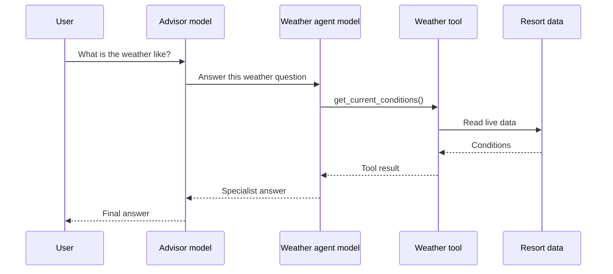
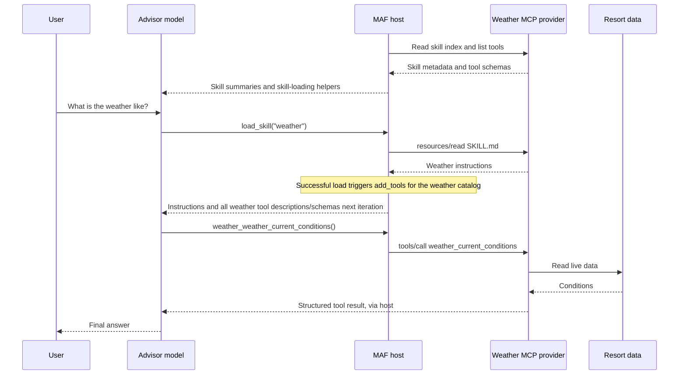

# From agents as tools to distributed skills over MCP

*Keep domain services distributed. Move the specialist's instructions into the advisor, and keep its operations as tools.*

A multi-agent system often starts with a straightforward design: one agent understands the user's request, delegates to specialists, and combines their answers.

That was the starting point for my ski resort demo. An advisor calls weather, safety, ski-coach, and lift-traffic agents over Agent-to-Agent (A2A). Each specialist has its own instructions, tools, and model loop.

It works. But does every specialist need to reason independently, or does the advisor mainly need its instructions and access to its operations?

To explore that distinction, the demo now has a second path: **distributed Agent Skills and tools over Model Context Protocol (MCP), composed with native Microsoft Agent Framework (MAF) capabilities**. Domain services still run remotely. Their instructions enter the advisor's context when needed, and their operations execute as ordinary MCP tools without another specialist model.

**Language note:** the skills advisor is Python and its four MCP providers are .NET. The A2A advisor is .NET, with Python and .NET specialists. These are independent implementation choices, not a requirement to rewrite services in another language. They explain why the examples below use both languages.

**Compatibility note, checked September 10, 2026:** the demo uses a pinned, historical [Draft profile of SEP-2640](https://github.com/modelcontextprotocol/modelcontextprotocol/blob/b3f015a7929041dada4b0eaf5a657b30d4f5d6d1/seps/2640-skills-extension.md). The proposal's latest text says Accepted, but its [PR remains unmerged](https://github.com/modelcontextprotocol/modelcontextprotocol/pull/2640) and newer discovery differs. Do not confuse this version-specific skill-transport profile with established core MCP resources and tools, or with MAF's separately experimental progressive-loading API.

## A small demo of a larger-catalog problem

The resort has only four skills and twelve tools. It is a simple setting for illustrating a problem that becomes more interesting with a large catalog: how to give the model the right procedures and tool schemas without placing everything in its initial context.

**For a genuinely small catalog, start simpler:** register the configured providers' MCP tools upfront using the standard SDK. You can still load skill instructions on demand. Progressive tool loading is optional, and the skill-to-provider registration hook discussed below is unnecessary in that eager-loading setup.

The goal here is to explore the larger-catalog pattern, not to claim that twelve tools require it.

## Two kinds of delegation

### Agent as a tool: delegate a task

The A2A advisor sees each remote agent as a callable function:



The specialist interprets a delegated question, chooses operations, and writes an answer. The advisor then interprets that answer. This is useful when the specialist needs autonomy, private context, a specialized model, or a substantial independent workflow.

### Agent as a skill: share a procedure, invoke an operation

The MCP provider instead publishes skill metadata, instructional documents, and typed tools:



There is no weather-agent model in the second path. There is still a weather service executing application code.

This is not "MCP replaces A2A everywhere." It changes the reasoning boundary for bounded capabilities. Nor does "one agent" mean "one model call": skill selection, operation selection, and answer generation can require several iterations.

## What actually migrates?

| Existing component | Skills-based equivalent |
|---|---|
| Specialist A2A hosting | MCP hosting for that domain's skills and tools |
| Agent Card name and description | Skill discovery name and description |
| Specialist system prompt | Domain procedure in an enriched `SKILL.md` |
| Specialist tools and parameter contracts | Typed MCP tools with input and output schemas |
| Business services and connectors | Remote services behind those tool handlers |
| Advisor's remote-agent function registrations | Native skill sources and MCP tool integration |
| Specialist's model loop | No equivalent inside the migrated provider |

Only the Agent Card's descriptive identity maps into skill metadata. Authentication, endpoints, and transport capabilities remain infrastructure concerns, not prose.

Most importantly, **tools stay tools**. The migration moves instructions and operation selection into the advisor. It does not move business logic into Markdown or require domain services to run inside the advisor process.

Both architectures remain available in this demo. The web-backed research agent also remains a direct agent tool in both advisors. Its independent reasoning is a separate choice from how weather or lift data is retrieved.

## 1. Separate domain logic from the specialist runtime

Start inside the specialist, not at its endpoint. Identify its instructions, model loop, and functions that reach the business system.

For weather, retrieving conditions and calculating the demonstration forecast already belong to a domain service. Expose that capability through a typed MCP adapter. The following is an excerpt from `WeatherTools.cs`; the result records and JSON-to-record helper are defined in the same file:

```csharp
[McpServerTool(
    Name = "weather_forecast",
    ReadOnly = true,
    Destructive = false,
    UseStructuredContent = true)]
[Description("Generate a demo hourly forecast from current conditions. Forecast variation is randomized.")]
public async Task<WeatherForecast> Forecast(
    [Description("Forecast horizon in hours, from 1 through 24."),
     Range(1, 24)] int hours,
    CancellationToken cancellationToken)
{
    if (hours is < 1 or > 24)
        throw new ArgumentOutOfRangeException(
            nameof(hours), "Hours must be between 1 and 24.");

    return Read<WeatherForecast>(
        await service.GetForecastAsync(hours, cancellationToken));
}
```

The .NET MCP SDK publishes the tool definition and binds calls to the method. The handler validates the range, passes cancellation through, and delegates to the existing service. Other tools return current conditions, storm assessments, lift waits, safety information, and coaching results.

"No model in the provider" does not mean constant output. The demo's telemetry changes over time, and its forecast uses randomized variation. The distinction is application logic versus another agent loop.

## 2. Publish discovery metadata and instructional resources

Each provider exposes its own MCP endpoint at `/skillsmcp`. Its resource surface contains only:

```text
skill://index.json
skill://<skill-name>/SKILL.md
```

For weather, the index is:

```json
{
  "$schema": "https://schemas.agentskills.io/discovery/0.2.0/schema.json",
  "skills": [
    {
      "name": "weather",
      "type": "skill-md",
      "description": "Weather intelligence agent providing real-time conditions, forecasts, and storm alerts for the ski resort",
      "url": "skill://weather/SKILL.md"
    }
  ]
}
```

The description carries the former Agent Card's routing information: when this competence is useful. It does not transfer the card's network or security configuration.

This index follows the historical draft profile pinned above and the installed MAF `MCPSkillsSource` implementation. The [September 3 proposal revision](https://github.com/modelcontextprotocol/modelcontextprotocol/blob/d6b31a03504c15677d49b922b6b6ace0ef65728d/seps/2640-skills-extension.md) is marked Accepted and specifies `skills/list` and `skills/get`; the demo does not implement those methods. Its PR was still open and unmerged when checked. Treat this example as a pinned draft-era convention, not the latest extension contract or a released core MCP requirement.

The `skill://` URI identifies content on an already configured MCP connection. It is not a hostname to resolve or a way for skill text to choose a new network endpoint. Additional supporting files, when needed, remain instructional resources.

## 3. Enrich the former system prompt into a skill

The description answers **when to use the competence**. `SKILL.md` answers **how to apply it**.

The former specialist's system prompt supplies the starting material: domain rules, interpretation, safety priorities, and response guidance. Review those instructions, remove assumptions about an independent conversation, and add the procedure for choosing the available tools.

Here is a **portable illustrative procedure**, not a verbatim copy of the demo's generated document:

```markdown
---
name: weather
description: Assess current resort weather, forecasts, and storm threats.
---

# Weather procedure

1. Use weather_current_conditions for current temperature, wind,
   snow intensity, visibility, and observation time.
2. Use weather_forecast when the request concerns later conditions.
   Supply an integer hours value from 1 through 24.
   Explain that this demo forecast is a simulation, not a weather service.
3. Use weather_storm_status when a storm assessment is relevant.
4. Report specific values with their units and source limitations.
   Prioritize safety and do not invent missing observations.
```

These are domain tool names, not host-specific loading functions. A skill can also refer to supporting documentation using relative paths, without naming a particular SDK's resource-reading helper.

The actual demo adds a separate host-specific section explaining that loading the skill makes its provider's tools available on the next model iteration. It lists their provider-prefixed callable names. That is integration guidance for this host, not a portable requirement of the skill format. The model chooses operations using the descriptions and schemas supplied by MCP, not just those names.

## 4. Host instructions and tools together

The weather provider registers both resource and tool handlers:

```csharp
builder.Services.AddMcpServer(options =>
    {
        options.ServerInfo = new()
        {
            Name = "weatherskills",
            Version = "1.0.0"
        };
    })
    .WithHttpTransport()
    .WithResources<WeatherSkillResources>()
    .WithTools<WeatherTools>();

var app = builder.Build();
app.MapMcp("/skillsmcp");
app.Run();
```

This shortened snippet omits ordinary domain-service and HTTP-client registration. `resources/read` retrieves instructions. `tools/list` supplies authoritative operation definitions. **`tools/call` executes the business operations.**

## 5. Compose native skills and progressive MCP tools

The Python advisor uses the standard `SkillsProvider` and `MCPSkillsSource`.
`SkillToolsMiddleware` supplies the small integration hook. Its `source`
aggregates native `CachingSkillsSource` wrappers around the configured MCP
sources, so the provider and hook share the same cached skill objects:

```python
skill_tools = SkillToolsMiddleware(connections)
skills = SkillsProvider(
    skill_tools.source,
    disable_load_skill_approval=True,
    disable_read_skill_resource_approval=True,
)
```

For each provider, native `MCPStreamableHTTPTool` discovers the catalog and builds callable functions. These are the relevant weather settings; the object is connected and retained host-side, not placed in the agent's initial tools:

```python
weather_tools = MCPStreamableHTTPTool(
    name="weather",
    url=weather_url,
    session=weather_session,
    tool_name_prefix="weather",
    load_prompts=False,
    use_progressive_disclosure=False,
    approval_mode="never_require",
)
```

Here `False` disables the MCP wrapper's model-facing per-tool loading helpers. It does **not** expose all tools to the model: the host retains the native functions until the corresponding skill loads. Dynamic exposure uses the public `FunctionInvocationContext.add_tools(...)` API instead.

The configured providers' catalogs are the source of truth. There is no second tool-name list in the advisor. The demo trusts these providers and uses `never_require` for their read-only operations; adding write operations would require revisiting approval policy. Endpoint configuration and provider prefixes keep routing explicit. The other prefixes are `safety`, `skicoach`, and `lifttraffic`.

### The model selects a skill; the host supplies its tool group

There are two different kinds of discovery:

1. Before the model runs, the host retrieves the configured providers' catalogs through paginated MCP `tools/list`, using app-owned connections and native tool objects.
2. The model initially receives skill metadata and skill-loading helpers, not the twelve operation schemas. Existing advisor instructions and the researcher tool are also present.
3. Native `load_skill` reads the chosen `SKILL.md`.
4. After that read succeeds, the host's integration hook registers **all native functions from that skill's configured provider** for this run through `add_tools`.
5. On the **next model iteration**, the advisor sees the instructions plus every tool description and parameter schema in the selected group. Loading weather exposes its three operations; the other providers remain hidden.
6. The model chooses which operation to invoke, for example `weather_weather_forecast({"hours":6})`. MAF sends MCP `tools/call` using the original remote name, `weather_forecast`.

The repeated `weather_` comes from adding the configured provider prefix to an already domain-prefixed remote name.

Loading the group does not execute all its operations. It gives the model enough information to choose among them without first guessing from tool names. There is no separate model-issued per-tool loader call.

This grouping follows the demo's one-skill-per-provider boundary. A provider containing several unrelated skills would need a more specific association. Skill content cannot redirect clients to another endpoint, and a failed skill load must not expose a tool group. Registration controls model context, not authorization.

MAF supplies progressive registration, not the skill-to-provider binding: that small association is our host integration, not automatic behavior built into `SkillsProvider`. There is no custom operation dispatcher or Foundry Toolbox. The sample uses Foundry's `gpt41` deployment, but the mechanism lives in MAF's function-calling integration, not a Foundry-only tool-search feature.

### The small amount of host glue

Both skills-advisor hosting surfaces, Responses and A2A, use the same Python builder and keep a shared agent. MCP connections stay open for the application's lifetime. Python's `AsyncExitStack` is the cleanup manager that closes them on shutdown and cleans up failed connection setup.

Connections and tool registrations have different lifetimes. Native catalog objects are reused without mutable per-tool-loader state. The integration adds their functions only to the current invocation, never to the shared agent's tool list.

The hook lives in `skills_orchestrator_python/native_mcp.py`. At initialization, it binds skill identities from the configured sources' metadata to their native catalogs and rejects ambiguous names. MAF 1.17 returns skill content rather than a typed success envelope: after native invocation, the hook compares the normalized text result with that same cached skill's public `get_content()` result. A known name alone is not enough to register tools; failures, cancellations, and non-text approval results do not qualify.

Those registrations last through the response stream and disappear when the run finishes, fails, or is cancelled. Followups load needed skills again; conversation history is retained separately. Nothing sends an unload command to the MCP server or closes its shared connection at the end of a request.

Provider operations use native `approval_mode="never_require"` and the SDK's automatic function invocation. The two `SkillsProvider` settings above also make instruction reads automatic, without an approval/resumption boundary. The hook does not maintain approval state or custom resumption logic; this demo uses automatic execution for its trusted read-only providers.

**The hook maps a successfully loaded skill to a provider catalog. MAF handles function registration, descriptions, schemas, dispatch, and execution.** This is deliberately a small integration, not a second tool framework.

The shared builder keeps provider operations out of the agent's initial tools:

```python
agent = client.as_agent(
    name="skiadvisorskill",
    instructions=INSTRUCTIONS,
    context_providers=[skills],
    tools=[researcher_tool],
    middleware=[skill_tools],
)
await skill_tools.initialize(agent, exit_stack)
```

The observer's registration step is `context.add_tools(native.functions)`.
The public SDK owns same-object deduplication and next-iteration visibility,
including when several skills are selected in one model iteration.

For the small-catalog alternative, use the same native MCP objects but register them directly in the agent's `tools`. All advertised operation definitions are then available upfront, and the skill-to-provider hook can be omitted. With group loading, selecting a skill adds more schemas than selecting one operation, but avoids a separate model step devoted to loading tool names.

## Following a real execution

For the comparison, I sent this exact prompt through both chat paths of the same running Aspire application, using skill-scoped implementation `56f453a`:

> considering weather and waiting time, where should i start?

Both requests entered through the frontend's Responses API proxy. One advisor used A2A specialists internally; the other used native MCP skills and tools. This compares two complete advisor paths, not a raw A2A request against a single MCP call.

In pairs 1 and 2, the A2A advisor selected weather and lift traffic. Each specialist used two model calls, and the advisor used two: six in total. In pair 3, it also selected the coach, whose single call requested missing skier information:

```text
A2A pair 3: observed call structure
  chat gpt41                         advisor selects specialists
  overlapping specialist calls:
    weatheragenta2a
      chat gpt41
      get_current_conditions
      chat gpt41
    lifttrafficagenta2a
      chat gpt41
      GetWaitTimes
      SuggestLessBusyArea
      chat gpt41
    skicoachagenta2a
      chat gpt41                     asks for skill level/preferences
  chat gpt41                         recommends Eagle Chair and asks about ability
```

That is seven model calls, not seven sequential calls. The remote specialists overlap, so adding their durations would not give client elapsed time.

All three skill-scoped runs selected weather and lift traffic and used this three-call model sequence:

```text
chat gpt41 #1
  load_skill({"skill_name":"weather"})
  load_skill({"skill_name":"lift-traffic"})

chat gpt41 #2
  weather_weather_current_conditions({})
  lifttraffic_lift_traffic_least_busy_area({})

chat gpt41 #3
  final answer
```

The host registered all three weather tools and all four lift-traffic tools after the skill reads. The model then selected one operation from each group, with their descriptions and schemas available. There was no separate tool-loader call. Skill reads and the two operation calls were each batched within their respective model iteration. All three model calls belonged to the advisor; `invoke_agent` aggregates are not additional model calls.

All six responses recommended Eagle Chair. They did not perform identical work: A2A called both `GetWaitTimes` and `SuggestLessBusyArea`, whereas the skills advisor called only `lift_traffic_least_busy_area`. Pair 3's A2A response also asked about skier ability after consulting the coach. Weather values and queue times changed between requests.

**Trace limitation:** the exported advisor/model spans carried each request's injected trace ID, including the A2A specialists. Native MCP provider HTTP operations appeared under separate trace IDs. I correlated those by destination and overlapping timestamps, not by inventing parent-child links. Frontend/root spans were not present in the export, so these are observed call structures, not screenshots of a complete end-to-end tree.

<!-- Optional screenshot: A2A pair 3, trace 6f8083fd86ac2ee454f9b9f7477ecb86, expanded to show weather, lift and coach. This is a local Aspire capture, not a publicly accessible trace. Remove authentication parameters and unrelated environment details. -->
<!-- Optional screenshot: skill-scoped pair 3, host/model trace b6f726e3dd6262cc440f44cdbad85367, showing three model calls: skill loads, direct operations, answer. Show weather provider trace 1b458a45fea5eebaf38506b4ff504ffc and lift provider trace dad07300af041f4d462bb6f91da520e9 separately; destination/timestamp correlation is not a connected trace tree. -->

## What changed in latency and tokens?

These measurements were captured on **September 10, 2026, 13:03-13:09 UTC**, against skill-scoped commit `56f453a`, using the `gpt41` deployment.

Each request used the exact prompt quoted above and a fresh conversation, with no previous response ID or history. All six reused already-running services and connections. The order was A2A/native in pair 1, native/A2A in pair 2, and A2A/native in pair 3, with at least 65 seconds between responses and subsequent requests.

Elapsed time is client wall-clock time from sending the frontend POST until its SSE response body finishes. It includes proxy, model, and tool work, but excludes cooldowns. It is not time to first token.

Token totals sum each unique leaf **`chat gpt41`** span once, including every remote A2A specialist. They do not add the `invoke_agent` aggregates or top-level API usage again.

| Pair | Architecture | Elapsed | Input tokens | Output tokens | Total tokens | Model calls | Cached input |
|---|---|---:|---:|---:|---:|---:|---:|
| 1 | A2A specialists | 16.416 s | 2,971 | 578 | 3,549 | 6 | Partial* |
| 1 | Native MCP skills | 8.661 s | 4,341 | 178 | 4,519 | 3 | 1,536 |
| 2 | Native MCP skills | 5.866 s | 4,337 | 165 | 4,502 | 3 | 1,536 |
| 2 | A2A specialists | 12.835 s | 2,974 | 580 | 3,554 | 6 | Partial* |
| 3 | A2A specialists | 17.188 s | 3,394 | 637 | 4,031 | 7 | Partial* |
| 3 | Native MCP skills | 4.517 s | 4,341 | 171 | 4,512 | 3 | 3,072 |

*A2A advisor spans reported zero cached input; specialist spans omitted cache counters. Whole-system cached input is therefore unknown, not zero. Native cached tokens are already included in input totals.*

**The skills path was faster in these reused-process, cache-affected runs:** mean elapsed time was 6.348 seconds versus 15.480 seconds for A2A. This does not isolate an architectural speedup from cache effects, first-use credential initialization, language/runtime differences, or the amount of work performed.

**It did not use fewer total tokens.** Across three runs, native skills consumed 13,533 observed tokens versus 11,134 for A2A, about 22% more. Fewer model calls did not mean less cumulative context. In the first skills run, input counts were 866, 1,593, and 1,882, totaling 4,341 as instructions, provider-group schemas, and results accumulated.

That is **not a billable-cost ratio**. Native runs reported 6,144 cached input tokens overall, and A2A specialist cache reporting was incomplete. Input, cached input, and output have different pricing implications. These measurements report tokens, not a dollar comparison.

There is an accounting trap in the other direction too. Pair 1's A2A Responses usage reported 1,751 tokens for the advisor. Weather added 633 and lift traffic 1,165, bringing the observed whole-system total to 3,549. Comparing only top-level API usage would omit more than half that request's tokens.

All six responses completed without benchmark retries or failing model spans. Non-model errors remain in the evidence: A2A queue-shutdown spans and approximately one-second managed-identity credential probes in the first A2A and skills requests. Those are not failed model calls, but their initialization overhead is included in wall time. Retries invisible inside an SDK request cannot be independently counted from this export.

This is a three-pair illustration, not a controlled performance or quality study. Processes were reused, prompt-cache hits varied, and live telemetry changed during cooldowns. A2A performed more lift queries and added a coach exchange in pair 3. All skills responses, and A2A's first response, used safety language without consulting the safety provider; those statements are not verified safety findings. Faster responses do not establish equally correct or complete advice.

The structural observation is narrower: **six, six, and seven model calls across A2A components versus three calls in each skills-advisor run**, with skill loading followed immediately by direct MCP operations. Whether that tradeoff helps another workload requires its own acceptance criteria and measurements.

<!-- Measurement evidence: skill-group-benchmark/reconciled-summary.json and pair-*-{a2a,skill}.json in this session's private artifacts. Raw SSE records, requested-trace exports, time-window exports, harness and hash manifest are retained; no failed or retried benchmark requests occurred.
Pair 1 A2A: 110dafad51477c2c90293a7bcce9bb06
Pair 1 native: e2c231565939d165a34bed57402b6cd5
Pair 2 native: 52a987c6c7d85698c1e5edffd287add3
Pair 2 A2A: 3a4fbbbc72d2a03b5882d536b77bc55c
Pair 3 A2A: 6f8083fd86ac2ee454f9b9f7477ecb86
Pair 3 native: b6f726e3dd6262cc440f44cdbad85367
Trace IDs refer to the local Aspire capture, not public URLs.
-->

## What I would carry into a production migration

Start with one bounded domain. Preserve the existing services, expose typed tools, and compare routing, data correctness, and answer quality before changing traffic.

Choose eager versus skill-scoped exposure according to the real catalog and workload. A skill should group related operations. Loading a whole provider saves a separate tool-selection step but supplies schemas that may not all be used; a smaller initial context is not automatically a faster or cheaper conversation.

Keep access policy in the host and provider, separate from skill instructions. Use credentials intended for the configured endpoint and deliberate request-context propagation. Do not place changing users' credentials in a shared client's mutable defaults or in skill text.

Finally, keep autonomy where it earns its cost. A researcher, specialized model, or independent workflow can remain an agent. A bounded capability can instead supply instructions and tools while keeping its service and data remote.

## The takeaway

The useful distinction is **delegating a task to another reasoner versus giving the current reasoner a procedure and access to its operations**.

In this demo, specialist hosting becomes MCP provider hosting. The Agent Card's descriptive identity becomes skill metadata, the system prompt becomes an enriched `SKILL.md`, and the tools remain tools.

The weather service stays remote. Its reasoning moves into the advisor. A small host hook binds skill loading to the provider's catalog; native MAF supplies request-local registration and remote invocation.

---

### Code and references

Repository: **[Ski resort multi-agent and distributed skills demo](https://github.com/tommasodotNET/ski-resort-demo)**.

The implementation is pinned to [commit `56f453a`](https://github.com/tommasodotNET/ski-resort-demo/commit/56f453a2c52de91ac71ef19da83caec4976f5a17). These permalinks identify the skill-scoped code used for this article:

| Area | Code path |
|---|---|
| Original A2A advisor | [`src/ski-advisor-a2a/Program.cs`](https://github.com/tommasodotNET/ski-resort-demo/blob/56f453a2c52de91ac71ef19da83caec4976f5a17/src/ski-advisor-a2a/Program.cs) |
| Shared skills advisor construction | [`agent_builder.py`](https://github.com/tommasodotNET/ski-resort-demo/blob/56f453a2c52de91ac71ef19da83caec4976f5a17/src/ski-advisor-skill/skills_orchestrator_python/agent_builder.py) |
| Skill-to-provider registration hook | [`native_mcp.py`](https://github.com/tommasodotNET/ski-resort-demo/blob/56f453a2c52de91ac71ef19da83caec4976f5a17/src/ski-advisor-skill/skills_orchestrator_python/native_mcp.py) |
| Provider endpoints and prefixes | [`config.py`](https://github.com/tommasodotNET/ski-resort-demo/blob/56f453a2c52de91ac71ef19da83caec4976f5a17/src/ski-advisor-skill/skills_orchestrator_python/config.py) |
| Generated weather skill | [`WeatherSkillCatalog.cs`](https://github.com/tommasodotNET/ski-resort-demo/blob/56f453a2c52de91ac71ef19da83caec4976f5a17/src/weather-skills/Skills/WeatherSkillCatalog.cs) |
| Weather tool adapters and typed results | [`WeatherTools.cs`](https://github.com/tommasodotNET/ski-resort-demo/blob/56f453a2c52de91ac71ef19da83caec4976f5a17/src/weather-skills/Tools/WeatherTools.cs) |
| Weather instructional resources and host | [`WeatherSkillResources.cs`](https://github.com/tommasodotNET/ski-resort-demo/blob/56f453a2c52de91ac71ef19da83caec4976f5a17/src/weather-skills/Skills/WeatherSkillResources.cs), [`Program.cs`](https://github.com/tommasodotNET/ski-resort-demo/blob/56f453a2c52de91ac71ef19da83caec4976f5a17/src/weather-skills/Program.cs) |
| Native-loop and local MCP coverage | [`tests/`](https://github.com/tommasodotNET/ski-resort-demo/tree/56f453a2c52de91ac71ef19da83caec4976f5a17/src/ski-advisor-skill/tests) |
| Aspire topology | [`src/apphost.cs`](https://github.com/tommasodotNET/ski-resort-demo/blob/56f453a2c52de91ac71ef19da83caec4976f5a17/src/apphost.cs) |

The distinction between format, transport, and SDK behavior matters:

- [Agent Skills format specification](https://agentskills.io/specification): `SKILL.md`, frontmatter, procedures, and supporting files.
- [MCP resources](https://modelcontextprotocol.io/specification/2025-11-25/server/resources) and [MCP tools](https://modelcontextprotocol.io/specification/2025-11-25/server/tools): the protocol primitives used here.
- [Historical SEP-2640 Draft revision](https://github.com/modelcontextprotocol/modelcontextprotocol/blob/b3f015a7929041dada4b0eaf5a657b30d4f5d6d1/seps/2640-skills-extension.md): the index-based transport profile implemented by this demo.
- [SEP-2640 proposal](https://github.com/modelcontextprotocol/modelcontextprotocol/pull/2640) and [September 3 accepted-text revision](https://github.com/modelcontextprotocol/modelcontextprotocol/blob/d6b31a03504c15677d49b922b6b6ace0ef65728d/seps/2640-skills-extension.md): evolving upstream status and a different discovery contract.
- [MAF function-invocation registration API](https://github.com/microsoft/agent-framework/blob/4507512f95effaae4518d658e86e9afc0ccb4514/python/packages/core/agent_framework/_middleware.py) and [native MCP implementation](https://github.com/microsoft/agent-framework/blob/4507512f95effaae4518d658e86e9afc0ccb4514/python/packages/core/agent_framework/_mcp.py): the public APIs used with `agent-framework-core==1.17.0`; progressive `add_tools` is experimental.
